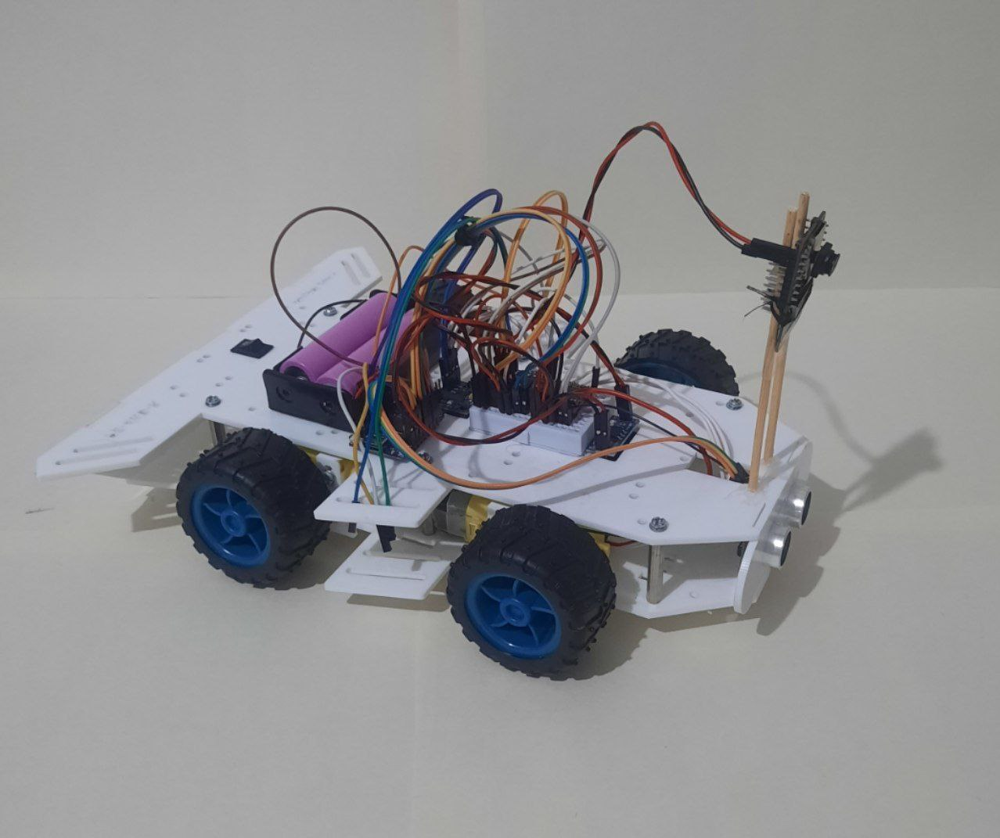
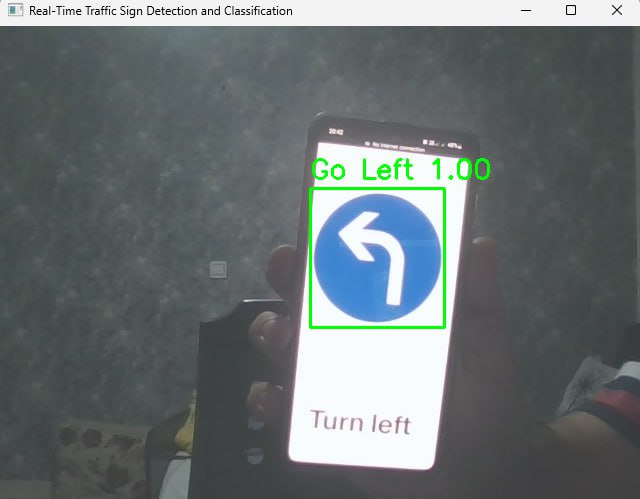
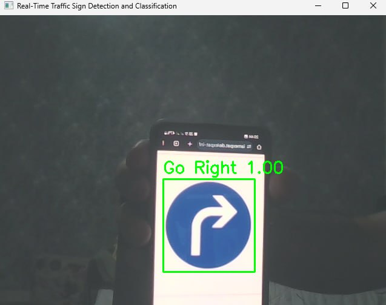
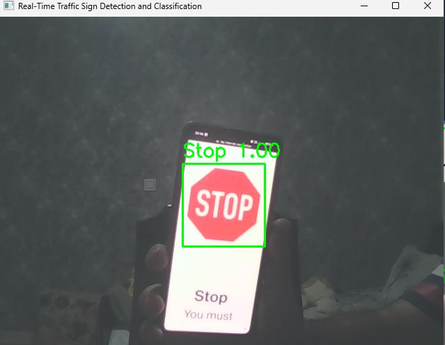
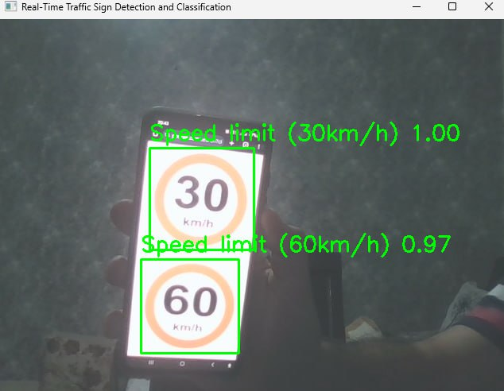

# Robot Navigation Based on Computer Vision

An autonomous robot navigation prototype that uses **computer vision and deep learning to detect and interpret traffic signs** in real time on resource-constrained hardware.

The system uses a distributed architecture consisting of an **ESP32-CAM** for image acquisition, a **Raspberry Pi 3 Model B** for computer-vision processing, and an **ESP32-S2 Mini** for robot control.

The vision pipeline combines **YOLOv5 for traffic-sign detection** with a custom **Convolutional Neural Network (CNN)** for traffic-sign classification.

---

## Overview

Autonomous robots operating in real-world environments need to perceive their surroundings, interpret visual information, and make decisions while operating under hardware and power constraints.

This project explores a practical approach to autonomous navigation using traffic-sign recognition.

The system follows this pipeline:‎

```text
┌───────────────┐
│  ESP32-CAM    │
│ Image Capture │
└───────┬───────┘
        │ Wi-Fi Video Stream
        ▼
┌───────────────────────────┐
│   Raspberry Pi 3 Model B  │
│                           │
│  YOLOv5                   │
│  Object Detection         │
│          ↓                │
│  Crop Detected Sign       │
│          ↓                │
│  CNN Classification       │
│          ↓                │
│  Navigation Decision      │
└────────────┬──────────────┘
             │
             │ Control Command
             ▼
┌───────────────────────────┐
│      ESP32-S2 Mini        │
│                           │
│  Motor Control            │
│  PWM / GPIO               │
│  MPU6050                   │
│  Ultrasonic Sensor        │
└────────────┬──────────────┘
             │
             ▼
        Robot Motion
```

The project was developed as a prototype for **autonomous navigation, robotics, and intelligent transportation systems**.
---
<p align="center">
  
</p>

<p align="center">
  <em>Autonomous robot prototype developed for this project.</em>
</p>

---

## Key Features

* Real-time traffic-sign detection using **YOLOv5**
* Traffic-sign classification using a custom **CNN**
* Distributed embedded-system architecture
* ESP32-CAM video streaming
* Raspberry Pi-based computer vision
* ESP32-S2 motor-control unit
* Wireless/serial communication between processing and control units
* MPU6050-based orientation feedback
* Ultrasonic obstacle detection
* TensorFlow Lite model conversion
* FP16 model optimization for resource-constrained deployment
* Real-time performance evaluation

---

## System Architecture

The system is divided into three main units.

### 1. Imaging Unit — ESP32-CAM

The ESP32-CAM captures images/video from the robot's environment and streams the frames to the Raspberry Pi.

Its main responsibilities are:

* Image acquisition
* Video streaming
* Communication with the processing unit

The ESP32-CAM was selected as a low-cost and low-power imaging device suitable for the prototype.

---

### 2. Processing Unit — Raspberry Pi 3 Model B

The Raspberry Pi performs the main computer-vision and machine-learning operations.

The processing pipeline consists of two stages:

```text
Camera Frame
     │
     ▼
Image Preprocessing
     │
     ▼
YOLOv5 Detection
     │
     ▼
Detected Bounding Box
     │
     ▼
Crop Traffic Sign
     │
     ▼
Resize to 48 × 48
     │
     ▼
CNN Classification
     │
     ▼
Navigation Command
```

YOLOv5 is responsible primarily for **localizing traffic signs**, while the custom CNN determines the specific sign category.

The YOLO detection class is intentionally not used as the final semantic classification. Instead, the detected region is cropped and passed to the dedicated CNN classifier.

---

### 3. Execution Unit — ESP32-S2 Mini

The ESP32-S2 Mini receives high-level navigation commands from the Raspberry Pi and converts them into motor-control signals.

Example commands include:

```text
STOP
LEFT_TURN
RIGHT_TURN
FORWARD_MOVE
```

The motor-control unit uses:

* PWM
* GPIO
* MPU6050
* Ultrasonic distance sensing

to control the robot's movement and provide basic navigation and obstacle-avoidance functionality.

---

# Machine Learning Pipeline

## Traffic-Sign Classes

The CNN was trained to classify seven categories:

| Class | Description           |
| ----- | --------------------- |
| 0     | Speed limit (30 km/h) |
| 1     | Speed limit (60 km/h) |
| 2     | Stop                  |
| 3     | Go straight           |
| 4     | Go Left               |
| 5     | Go Right              |
| 6     | Background / No Sign  |

---

## Dataset Preparation

The dataset was prepared for supervised CNN training.

The data pipeline included:

* Image collection
* Data organization
* Numerical array conversion
* Data augmentation
* Background sample generation
* Dataset shuffling
* Stratified train/validation/test splitting

The dataset was divided into:

```text
70%  Training
15%  Validation
15%  Testing
```

The project also used class weighting to address differences in the number of samples between classes, particularly for the speed-limit categories.

---

# CNN Classifier

The custom CNN receives RGB images resized to:

```text
48 × 48 × 3
```

The architecture contains three main convolutional blocks.

```text
Input: 48 × 48 × 3
        │
        ▼
Conv2D — 32 filters
BatchNorm
ReLU
MaxPooling
Dropout
        │
        ▼
Conv2D — 64 filters
BatchNorm
ReLU
MaxPooling
Dropout
        │
        ▼
Conv2D — 128 filters
BatchNorm
ReLU
MaxPooling
Dropout
        │
        ▼
Flatten
        │
        ▼
Dense — 512
        │
Dense — 256
        │
Dense — 128
        │
        ▼
Dense — 7
Softmax
```

Training incorporated:

* 100 epochs
* Initial learning rate of `0.001`
* Class weighting
* Model checkpointing
* Learning-rate reduction
* Early stopping

The training curves showed increasing training and validation accuracy during training, with the final model achieving very high classification performance on the reported test set.

---

# YOLOv5 Detection

YOLOv5 was used for traffic-sign localization.

The detection pipeline uses:

* RGB image conversion
* Normalization
* YOLOv5 inference
* Non-Maximum Suppression
* Bounding-box extraction

The reported inference configuration used:

```text
Confidence threshold: 0.50
IoU threshold:        0.45
```

After detecting a sign, the corresponding region is cropped and passed to the CNN classifier.

This creates a two-stage vision system:

```text
YOLOv5
Detection / Localization
        │
        ▼
Traffic Sign Crop
        │
        ▼
CNN
Semantic Classification
```
### Detection Examples

<p align="center">
  
  
  
  
</p>
---

# Real-Time Processing

The complete real-time pipeline operates on the Raspberry Pi.

For each incoming frame:

1. Capture the frame from the ESP32-CAM.
2. Convert the frame to RGB.
3. Normalize the image.
4. Run YOLOv5.
5. Apply non-maximum suppression.
6. Extract detected regions.
7. Crop the traffic sign.
8. Resize the crop to `48 × 48`.
9. Normalize the CNN input.
10. Run CNN classification.
11. Convert the predicted class into a navigation command.
12. Send the command to the ESP32-S2.
13. Execute the corresponding robot movement.

---

# Model Optimization

Because the Raspberry Pi has limited computational resources, model deployment was also investigated.

The CNN was converted from Keras to **TensorFlow Lite**:

```text
Keras CNN
    │
    ▼
TensorFlow Lite Converter
    │
    ▼
Default Optimization
    │
    ▼
FP16 Model
    │
    ▼
Embedded / Edge Deployment
```

The reported implementation uses:

```python
converter.optimizations = [tf.lite.Optimize.DEFAULT]
converter.target_spec.supported_types = [tf.float16]
```

The resulting model size was checked against a project limit of:

```text
50 MB
```

The goal of this optimization stage was to reduce deployment overhead and make the CNN more suitable for resource-constrained devices.

> **Note:** The implemented optimization uses FP16 support. INT8 quantization is considered a possible future optimization rather than something this project should claim as already implemented.

---

# Experimental Results

## YOLOv5 Detection

The reported YOLOv5 evaluation achieved approximately:

| Metric       | Result |
| ------------ | -----: |
| mAP@0.5      |   ~95% |
| mAP@0.5:0.95 |   ~78% |
| Recall       |   ~92% |
| Precision    |   ~94% |

In video experiments, traffic signs were localized with approximately **98% accuracy at distances of 1–5 meters under normal lighting conditions**.

Under low-light conditions below approximately **50 lux**, localization performance decreased to around **85%**.

---

## End-to-End System

In laboratory testing using 100 frames:

```text
Overall correct recognition: ~96%
YOLO + CNN processing time:  ~65 ms
```

The CNN prediction confidence was above `0.90` in approximately 85% of the tested cases.

The reported bounding boxes had an average IoU of approximately `0.85`.

---

# Hardware

| Component              | Role                                  |
| ---------------------- | ------------------------------------- |
| ESP32-CAM              | Image acquisition and video streaming |
| Raspberry Pi 3 Model B | Computer vision and ML inference      |
| ESP32-S2 Mini          | Motor and robot control               |
| MPU6050                | Orientation / motion sensing          |
| Ultrasonic Sensor      | Obstacle detection                    |
| DC Motors              | Robot movement                        |

The Raspberry Pi 3 Model B was used as the main processing platform because it was the available computing board for the project.

The system therefore represents a realistic **resource-constrained edge-AI scenario** rather than relying on a dedicated GPU platform.

---

# Communication and Control

The Raspberry Pi converts CNN predictions into high-level navigation commands.

For example:

```text
CNN Prediction
      │
      ▼
"Stop"
      │
      ▼
STOP
      │
      ▼
ESP32-S2
      │
      ▼
Motor Control
```

Similarly:

```text
"Go Left"    → LEFT_TURN
"Go Right"   → RIGHT_TURN
"Go straight" → FORWARD_MOVE
"Stop"       → STOP
```

The commands are transmitted to the execution unit using a communication protocol such as Wi-Fi or serial communication.

---

# Resource Constraints

One of the main engineering challenges was running computer-vision workloads on limited hardware.

The project had to balance:

```text
Accuracy
   ↕
Inference Latency
   ↕
Model Size
   ↕
Memory
   ↕
Power Consumption
   ↕
Hardware Capability
```

For example, the Raspberry Pi does not provide the type of CUDA-capable GPU acceleration available on dedicated NVIDIA platforms. Consequently, inference performance was constrained by the available CPU resources.

The project therefore highlighted an important principle:

> An AI model cannot always be optimized independently of the hardware on which it runs.

---

# Limitations

Several limitations were identified during development.

### Computational Performance

The reported YOLOv5 inference time on the Raspberry Pi was approximately 50 ms.

A lighter YOLO model was proposed as a future optimization, with the report estimating that inference time could potentially be reduced toward approximately 30 ms.

### Low-Light Performance

The ESP32-CAM's image quality becomes a limitation under low-light conditions.

The report proposes adding an infrared LED module controlled through GPIO as a possible improvement.

### Battery Capacity

The prototype was also constrained by limited battery capacity.

### Motor Control

The current navigation approach could be improved with a more advanced motor-control strategy.

The report proposes **PID-based motor control** as a future improvement for more precise speed and steering control.

### Mechanical Design

The robot's Ackermann steering configuration and the available mechanical resources limited the ability to further optimize the physical chassis and steering geometry.

---

# What I Learned

This project provided practical experience across several layers of an AI-enabled embedded system:

* Computer vision
* Deep learning
* Object detection
* CNN classification
* Embedded systems
* Edge computing
* Distributed system design
* Raspberry Pi development
* ESP32 development
* Real-time inference
* Model optimization
* TensorFlow Lite
* Sensor integration
* Motor control
* Communication between embedded devices

More importantly, the project demonstrated that building an AI system for embedded deployment involves more than maximizing model accuracy.

A useful system must consider the interaction between:

```text
AI Model
    +
Hardware
    +
Latency
    +
Memory
    +
Power
    +
Communication
    +
Application Requirements
```

---

# Future Work

Several directions could extend this prototype.

### 1. Systematic Hardware Benchmarking

Evaluate the same models across different edge platforms and compare:

* Inference latency
* Memory usage
* Power consumption
* Throughput
* Accuracy

### 2. Model Compression

Investigate:

* FP16
* INT8 quantization
* Pruning
* Knowledge distillation
* Smaller CNN architectures

### 3. Lightweight Object Detection

Compare different YOLO model sizes and architectures to identify the best accuracy/latency trade-off for edge deployment.

### 4. Input Resolution Optimization

Evaluate the effect of different image resolutions on:

```text
Accuracy
Latency
Memory
Power
```

### 5. Improved Navigation

Integrate PID-based motor control and improve steering accuracy.

### 6. Low-Light Vision

Investigate additional illumination and image-processing techniques for reliable operation in low-light environments.

### 7. Hardware–AI Co-Design

A particularly interesting extension would be to systematically explore combinations of:

```text
Model Architecture
       ×
Model Precision
       ×
Input Resolution
       ×
Hardware Platform
       ×
Application Constraints
```

and identify configurations that provide the best trade-off between accuracy, latency, energy consumption, memory, and computational resources.

---

# Technologies

* **Python**
* **OpenCV**
* **PyTorch**
* **YOLOv5**
* **TensorFlow / Keras**
* **TensorFlow Lite**
* **NumPy**
* **ESP32**
* **Raspberry Pi**
* **MPU6050**
* **Ultrasonic Sensor**

---

# Research Perspective

Although this project was developed as a practical autonomous-navigation prototype, it also exposed a broader research problem.

The main question during development was essentially:

> **How can an autonomous vision system achieve reliable real-time performance on limited hardware?**

The prototype demonstrated one possible solution using a distributed architecture and two-stage vision pipeline.

A natural next step is to move from manually selecting one working configuration toward **systematic hardware–AI co-design**:

```text
Application Requirements
          │
          ▼
 ┌─────────────────────┐
 │ AI Model Candidates │
 └──────────┬──────────┘
            │
            ▼
 ┌─────────────────────┐
 │ Compression /       │
 │ Precision Choices   │
 └──────────┬──────────┘
            │
            ▼
 ┌─────────────────────┐
 │ Hardware Candidates │
 └──────────┬──────────┘
            │
            ▼
 ┌──────────────────────────┐
 │ Design-Space Exploration │
 └────────────┬─────────────┘
              │
              ▼
      Accuracy / Latency
      Power / Memory
      Throughput / Area
              │
              ▼
      Efficient Configuration
```
